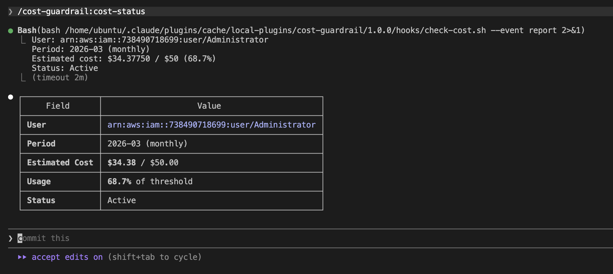
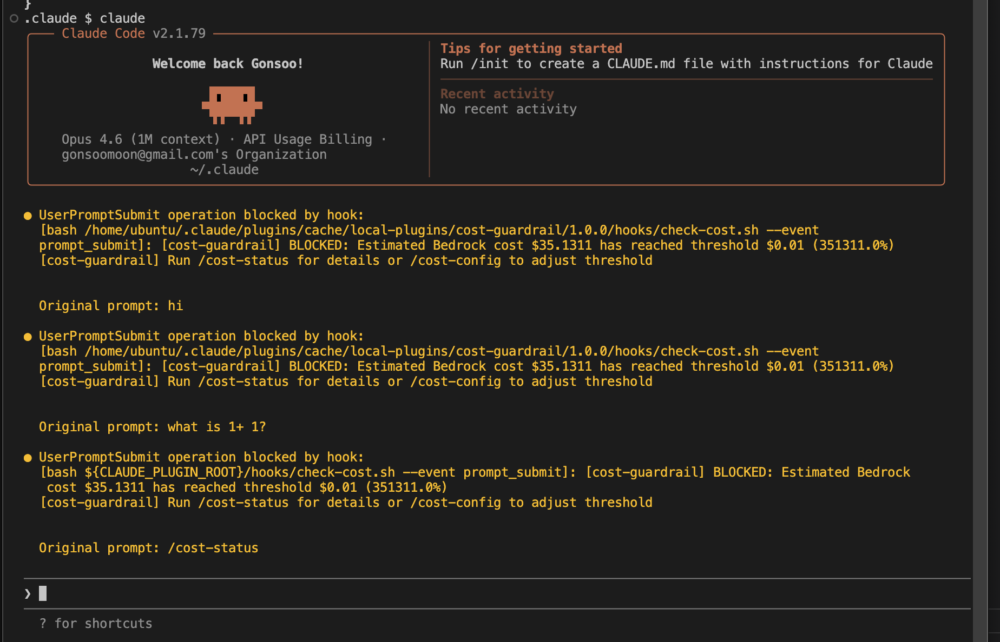
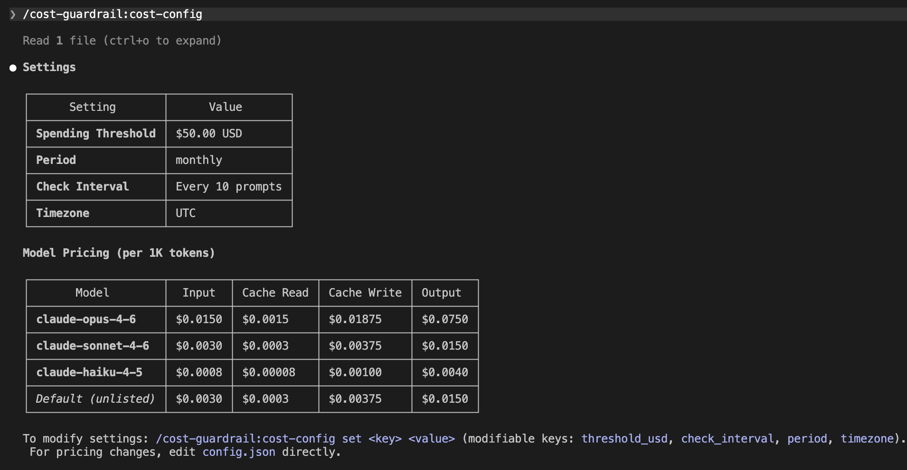

# Amazon Bedrock Cost Guardrail Plugin for Claude Code (관리자용 소스 저장소)

IAM 사용자별 Amazon Bedrock API 비용을 모니터링하고, 설정된 임계값에 도달하면 Claude Code 사용을 자동 차단하는 플러그인입니다.

> 이 저장소는 **관리자용 소스 저장소**입니다. 직원에게 배포되는 플러그인은 [마켓플레이스 저장소](https://github.com/gonsoomoon-ml/bedrock-cost-guardrail)에서 관리합니다.
>
> 처음이신가요? [초보자 가이드](docs/beginners-guide.md)에서 용어 설명, 비용 계산 방식, FAQ를 확인하세요.

## 두 저장소 구조

| 저장소 | 용도 | 대상 |
|--------|------|------|
| **이 저장소** (source) | 개발, 설정 관리, 릴리스 | 관리자 |
| [마켓플레이스 저장소](https://github.com/gonsoomoon-ml/bedrock-cost-guardrail) (dist) | 플러그인 배포 | 직원 (500명+) |

관리자가 이 저장소에서 설정을 변경하고 `release.sh`를 실행하면, 마켓플레이스 저장소에 직원용 플러그인이 배포됩니다.

## 빠른 시작 (관리자)

### 1. 사전 점검

```bash
bash scripts/preflight.sh
```

### 2. 설정 조정

```bash
vi admin/config.admin.json    # 관리자 임계값, 시간대 등
vi admin/config.dist.json     # 직원 기본값
```

### 3. 직원에게 배포

```bash
bash scripts/release.sh /path/to/bedrock-cost-guardrail
```

직원이 [마켓플레이스 저장소](https://github.com/gonsoomoon-ml/bedrock-cost-guardrail)에서 `bash install.sh`를 실행하면 자동으로 설치됩니다.

### 4. 비용 확인

```
/bedrock-cost-guardrail:cost-status
```



### 5. 임계값 초과 시

비용이 임계값에 도달하면 자동으로 차단됩니다.



## 사용법

### 설정 조회
```
/bedrock-cost-guardrail:cost-config show
```

> **참고:** `threshold_usd`, `progressive` 등 정책 설정은 `admin/config.admin.json`(관리자) 또는 `admin/config.dist.json`(직원 기본값)을 직접 편집하세요.



## 아키텍처

### 저장소 구조

```
# 플러그인 파일 (직원에게 배포되는 파일들)
.claude-plugin/plugin.json      # 플러그인 메타데이터
commands/
  cost-status.md                # /cost-status 명령
  cost-config.md                # /cost-config 명령
hooks/
  hooks.json                    # SessionStart + UserPromptSubmit 훅
  check-cost.sh                 # 메인: 이벤트 처리, 설정 병합, 흐름 제어
  lib-cost.sh                   # 라이브러리: 비용 계산, CW 쿼리, 일별 누적, 캐시
skills/
  cost-awareness/SKILL.md       # AI 비용 인식 컨텍스트
config.json                     # 공유 설정: 모델 가격표, log_group, 기본 단가

# 관리자 전용 (배포되지 않음)
admin/
  config.admin.json             # 관리자 정책 (임계값, 기간, 체크 간격 등)
  config.dist.json              # 직원 기본값 (릴리스 시 config.json과 병합)
scripts/
  release.sh                    # 마켓플레이스 배포 스크립트
  preflight.sh                  # 사전 요구사항 점검
docs/
```

### 설정 구조 (3파일 병합)

모델 가격표는 한 곳에서 관리하고, 정책은 관리자/직원 별도로 설정합니다:

```
config.json (공유)                      admin/config.admin.json (관리자)
┌────────────────────┐                  ┌─────────────────────────┐
│ log_group           │                  │ threshold_usd: 1000     │
│ pricing: {...}      │                  │ period: monthly         │
│ default_*_per_1k    │                  │ check_interval: 10      │
└─────────┬──────────┘                  │ timezone: Asia/Seoul    │
          │                              │ progressive: {...}      │
          │    jq -s '.[0] * .[1]'       └────────────┬────────────┘
          └──────────────┬────────────────────────────┘
                         ▼
              관리자 런타임 설정 (병합 결과)


config.json (공유)                      admin/config.dist.json (직원)
┌────────────────────┐                  ┌─────────────────────────┐
│ log_group           │                  │ threshold_usd: 180      │
│ pricing: {...}      │                  │ period: monthly         │
│ default_*_per_1k    │                  │ timezone: UTC           │
└─────────┬──────────┘                  │ progressive: {...}      │
          │    jq -s '.[0] * .[1]'       └────────────┬────────────┘
          └──────────────┬────────────────────────────┘
                         ▼
              직원 배포 config.json (release.sh)
```

- **가격 변경**: `config.json`만 수정 → 관리자 플러그인, 직원 플러그인 모두 반영
- **관리자 임계값 변경**: `admin/config.admin.json` 수정
- **직원 임계값 변경**: `admin/config.dist.json` 수정 → `release.sh` 실행 → 직원이 `bash install.sh` 재실행 → `/bedrock-cost-guardrail:cost-config show`로 확인

### 구성 요소

```
┌─────────────────────────────────────────────────────────────────────────────┐
│  Claude Code CLI                                                            │
│                                                                             │
│  SessionStart / UserPromptSubmit                                            │
│       │                                                                     │
│       ▼                                                                     │
│  ~/.claude/settings.json ◄── 차단 훅 등록 (exit 2 → hard block)            │
└───────┬─────────────────────────────────────────────────────────────────────┘
        │  bash check-cost.sh
        ▼
┌─────────────────────────────────────────────────────────────────────────────┐
│  bedrock-cost-guardrail 플러그인                                            │
│                                                                             │
│  ┌──────────────────┐    ┌────────────────────────────────────────────┐     │
│  │ /cost-status ────────►│        hooks/check-cost.sh (메인)          │     │
│  │ /cost-config ──┐ │    │        hooks/lib-cost.sh (라이브러리)       │     │
│  └────────────────┼──┘    └──┬──────────┬──────────┬────────────────┘     │
│                   │          │          │          │                       │
│                   ▼          │          │          │                       │
│         config.json          │          │          │                       │
│      + admin/config.*.json   │          │          │                       │
│        (jq merge)            │          │          │                       │
│                              │          │          │                       │
│  skills/cost-awareness       │          │          │                       │
│  (AI 비용 인식 컨텍스트)       │          │          │                       │
└──────────────────────────────┼──────────┼──────────┼───────────────────────┘
                               │          │          │
              ┌────────────────┘          │          └──────────────┐
              ▼                           ▼                         ▼
┌──────────────────────┐  ┌──────────────────────────┐  ┌─────────────────────┐
│  /tmp/ (로컬 상태)     │  │  AWS STS                  │  │  AWS CloudWatch     │
│                        │  │                            │  │  Logs Insights      │
│  counter 파일          │  │  sts:GetCallerIdentity     │  │                     │
│  (N번째 프롬프트 추적)  │  │  → IAM User ARN 식별       │  │  logs:StartQuery    │
│                        │  │                            │  │  logs:GetQueryResults│
│  cache.json            │  └──────────────────────────┘  │  → 토큰 사용량 조회   │
│  (비용 캐시, 5분 TTL)  │                                 │                     │
│                        │                   ┌──────────────┤                     │
│  daily.json            │                   │              └─────────────────────┘
│  (일별 누적 상태)       │                   │
└──────────────────────┘                    │
                                  ┌─────────┴──────────┐
                                  │  Bedrock Model      │
                                  │  Invocation Logging  │
                                  │  → 로그 기록          │
                                  └──────────────────────┘
```

### 비용 확인 흐름

```
═══════════════════════════════════════════════════════════════
  1. SessionStart (세션 시작 시 — 항상 실행)
═══════════════════════════════════════════════════════════════

  Claude Code
      │
      │  --event session_start
      ▼
  check-cost.sh
      │
      ├──► config.json + admin/config.admin.json 병합 (jq merge)
      │
      ├──► /tmp/counter = 0  (초기화)
      │
      ├──► AWS STS: get-caller-identity → IAM User ARN
      │
      ├──► 일별 누적: 어제 비용 확정 (finalize_yesterday)
      │         └──► 어제 하루치 CW 쿼리 → daily.json 업데이트
      │
      ├──► 오늘 하루치 CW 쿼리 (오늘 00:00 → 현재)
      │         ├──► progressive backoff 폴링 (2,2,3,3,...최대 25초)
      │         └──► 모델별 토큰 수 → 비용 계산
      │
      ├──► 총 비용 = previous_total + 오늘 비용
      │
      ├──► /tmp/cache.json 저장
      │
      └──► 판정
            │
            ├── 비용 >= 임계값 ──► exit 2 (BLOCKED) ──► 사용 차단
            └── 비용 <  임계값 ──► exit 0 (허용)    ──► 정상 사용


═══════════════════════════════════════════════════════════════
  2. UserPromptSubmit (매 프롬프트 입력 시)
═══════════════════════════════════════════════════════════════

  사용자 프롬프트 입력
      │
      │  --event prompt_submit
      ▼
  check-cost.sh
      │
      ├──► Progressive Checking: 캐시된 비용으로 체크 간격 결정
      │         비용 < 50%  → 50번째마다 (느슨)
      │         비용 50~80% → 20번째마다 (중간)
      │         비용 > 80%  → 5번째마다  (촘촘)
      │
      ├──► /tmp/counter 읽기 & 증가
      │
      ├── counter < effective_interval?
      │       │
      │       YES ──► counter 저장 ──► exit 0 (스킵)
      │       │
      │       NO  ──► counter = 0 (리셋)
      │               │
      │               ├──► /tmp/cache.json 확인 (5분 이내?)
      │               │       │
      │               │       YES ──► 캐시된 비용 사용
      │               │       │
      │               │       NO  ──► 오늘 하루치 CW 쿼리
      │               │               └──► 총 비용 = previous_total + 오늘 비용
      │               │
      │               └──► 판정
      │                     │
      │                     ├── 비용 >= 임계값 ──► exit 2 (BLOCKED)
      │                     └── 비용 <  임계값 ──► exit 0 (허용)
```

## 사전 요구사항

- **Bedrock Model Invocation Logging** 활성화 (CloudWatch Logs로 출력)
  - 로그 그룹명: `bedrock/model-invocations` (기본값)
  - `aws/` 접두사는 AWS 예약어이므로 사용 불가
  - IAM Role 필요: Bedrock → CloudWatch Logs 쓰기 권한
- **AWS CLI v2** 설치 및 설정 (필요 권한: `logs:StartQuery`, `logs:GetQueryResults`, `sts:GetCallerIdentity`)
- **jq**, **awk** 설치 (bc는 불필요)

### 사전 점검 스크립트

설치 후 `preflight.sh`로 모든 요구사항을 한번에 점검할 수 있습니다:

```bash
bash scripts/preflight.sh
```

```
Platform: linux (aarch64)

[PASS] Bash 5.2
[PASS] jq jq-1.7
[PASS] awk 사용 가능
[PASS] AWS CLI: aws-cli/2.33.11
[PASS] AWS 인증: arn:aws:iam::123:user/Administrator
[PASS] 로그 그룹: bedrock/model-invocations
[PASS] CloudWatch 쿼리 권한 (logs:StartQuery)

결과: 7 통과, 0 실패, 0 경고
```

플랫폼별(macOS, Linux, WSL, Git Bash) 설치 명령도 자동 안내합니다.

## 설치

### 직원 설치 (자동)

직원은 [마켓플레이스 저장소](https://github.com/gonsoomoon-ml/bedrock-cost-guardrail)에서 `install.sh` 하나로 설치합니다:

```bash
bash install.sh
```

`install.sh`가 사전 요구사항 점검, 마켓플레이스 등록, 플러그인 설치, settings.json 훅 등록, 설치 검증을 모두 자동으로 처리합니다. 자세한 내용은 [마켓플레이스 저장소 README](https://github.com/gonsoomoon-ml/bedrock-cost-guardrail)를 참고하세요.

### 관리자 설치 (이 저장소에서 직접)

관리자가 소스 저장소에서 직접 실행할 때는 수동으로 설정합니다:

```bash
# 1. 사전 요구사항 점검
bash scripts/preflight.sh

# 2. 플러그인 유효성 검증
claude plugin validate .
```

> **중요:** 플러그인의 `hooks.json`만으로는 차단이 동작하지 않습니다.
> 실제 차단을 위해서는 `~/.claude/settings.json`에 훅을 직접 등록해야 합니다.

`~/.claude/settings.json`에 hooks 섹션을 추가합니다:

```bash
PLUGIN_PATH="$HOME/.claude/plugins/bedrock-cost-guardrail/plugins/bedrock-cost-guardrail"

jq --arg ss "bash $PLUGIN_PATH/hooks/check-cost.sh --event session_start" \
   --arg ps "bash $PLUGIN_PATH/hooks/check-cost.sh --event prompt_submit" \
   '.hooks = {
     "SessionStart": [{"hooks": [{"type": "command", "command": $ss, "timeout": 60}]}],
     "UserPromptSubmit": [{"hooks": [{"type": "command", "command": $ps, "timeout": 30}]}]
   }' ~/.claude/settings.json > /tmp/settings.json && cp /tmp/settings.json ~/.claude/settings.json
```

플러그인 배포 방식(Official, GitHub, Local)에 대한 자세한 내용은 [초보자 가이드 — 마켓플레이스 배포 방식](docs/beginners-guide.md#마켓플레이스-배포-방식)을 참고하세요.

## 설정

### 설정 파일 구조

| 파일 | 용도 | 누가 편집? |
|------|------|-----------|
| `config.json` | 공유: 모델 가격표, log_group, 기본 단가 | 관리자 (가격 변경 시) |
| `admin/config.admin.json` | 관리자 정책: 임계값, 기간, 체크 간격 | 관리자 |
| `admin/config.dist.json` | 직원 기본값: 임계값, 기간, 체크 간격 | 관리자 (릴리스 전) |

실행 시 `config.json` + `admin/config.admin.json`이 자동 병합됩니다 (`jq -s '.[0] * .[1]'`).

### 공유 설정 (config.json)

| 필드 | 기본값 | 설명 |
|------|--------|------|
| `log_group` | "bedrock/model-invocations" | CloudWatch Logs 그룹명 |
| `pricing` | (모델별) | 모델별 4종 토큰 단가 (input/output/cache_read/cache_write per 1K) |
| `default_input_per_1k` | 0.003 | pricing에 없는 모델의 기본 입력 단가 |
| `default_output_per_1k` | 0.015 | pricing에 없는 모델의 기본 출력 단가 |
| `default_cache_read_per_1k` | 0.0003 | pricing에 없는 모델의 기본 cache read 단가 |
| `default_cache_write_per_1k` | 0.00375 | pricing에 없는 모델의 기본 cache write 단가 |

### 정책 설정 (admin/config.admin.json, admin/config.dist.json)

| 필드 | 관리자 기본값 | 직원 기본값 | 설명 |
|------|-------------|-----------|------|
| `threshold_usd` | 1000 | 180 | 차단 임계값 (USD) — **관리자만 변경 가능** |
| `period` | "monthly" | "monthly" | 비용 집계 기간 ("monthly" 또는 "daily") |
| `check_interval` | 10 | 10 | 매 N번째 프롬프트마다 비용 확인 (progressive 미사용 시) |
| `timezone` | "Asia/Seoul" | "UTC" | 일간/월간 기간 경계 시간대 |
| `progressive` | {"low":50,"mid":20,"high":5} | 동일 | 적응형 체크 간격 (아래 참조) |

### Progressive Checking (적응형 체크 간격)

비용 근접도에 따라 체크 간격을 자동 조절합니다:

| 비용 수준 | 체크 간격 | 예시 (30 프롬프트/시간 기준) |
|----------|----------|--------------------------|
| < 50% of threshold | `low` (기본 50) | ~1.7시간에 1번 CW 쿼리 |
| 50~80% | `mid` (기본 20) | ~40분에 1번 |
| > 80% | `high` (기본 5) | ~10분에 1번 |

## 동작 방식

1. **SessionStart** — 세션 시작 시 항상 비용 확인 (캐시 바이패스). 어제 비용 확정.
2. **UserPromptSubmit** — Progressive Checking으로 적정 간격마다 비용 확인
3. **설정 병합** — `config.json` + `admin/config.admin.json`을 jq merge
4. **일별 누적** — 오늘 하루치만 CW 쿼리 (이전 일자는 daily.json에 캐시). 월말 기준 스캔량 ~31배 절감.
5. **비용 계산** — 토큰 수 (input + cache read + cache write + output) × 모델별 단가
6. **판정** — 비용 >= 임계값 → exit 2 (hard block), 비용 < 임계값 → exit 0 (허용)
7. **주간 보정** — 7일마다 전체 월 쿼리로 일별 누적 drift 보정

### 플러그인 훅 vs settings.json 훅

| 구분 | 플러그인 hooks.json | settings.json hooks |
|------|-------------------|-------------------|
| 차단 (non-zero exit) | 동작 안 함 (알림 전용) | **동작함** |
| 커맨드/스킬 제공 | /cost-status, /cost-config | 해당 없음 |
| 설치 방식 | `claude plugin install`로 자동 | 수동 등록 필요 |

**두 가지를 함께 사용해야 합니다:**
- 플러그인: 커맨드(`/bedrock-cost-guardrail:cost-status`, `/bedrock-cost-guardrail:cost-config`)와 스킬(cost-awareness) 제공
- settings.json 훅: 실제 비용 초과 시 차단 실행

### 크로스 플랫폼 지원

macOS, Linux, Windows WSL/Git Bash에서 동작합니다:
- 산술: `awk` 사용 (`bc` 불필요 — Git Bash에서 `bc` 미설치 문제 해결)
- 날짜: 수학 기반 epoch 계산 (`date -d` 대신 — macOS 호환)
- `bash scripts/preflight.sh`로 플랫폼별 요구사항 점검

## 릴리스 (직원 배포)

`config.json` + `admin/config.dist.json`을 병합하여 마켓플레이스 저장소에 배포합니다:

```bash
# 1. 마켓플레이스 저장소에 배포
bash scripts/release.sh /path/to/bedrock-cost-guardrail

# 2. 변경 확인 및 커밋
cd /path/to/bedrock-cost-guardrail
git add -A && git diff --cached --stat
git commit -m "Release vX.Y.Z"
git push
```

릴리스 시 복사되는 파일:
- `.claude-plugin/plugin.json`, `commands/`, `hooks/` (check-cost.sh + lib-cost.sh), `skills/`
- `config.json` (base + dist 병합 결과 — 현재 직원 임계값: $180)
- `img/` (스크린샷: cost-status, cost-config, block_claude)

## 에러 처리 (Fail-Open)

모든 에러 상황에서 **사용을 허용**합니다 (fail-open). 인프라 문제로 개발자가 차단되는 것을 방지합니다.

| 상황 | 동작 |
|------|------|
| AWS 자격 증명 실패 | exit 0 (허용) |
| CloudWatch 쿼리 타임아웃 | 캐시 사용, 캐시 없으면 exit 0 |
| config.json 누락/오류 | exit 0 (허용) |
| lib-cost.sh 누락 | exit 0 (허용) |
| 미등록 모델 | 기본 단가 적용 |
| threshold_usd = 0 | exit 0 (허용) |

## Bedrock 로깅 설정 방법

### IAM Role 생성

```bash
aws iam create-role \
  --role-name BedrockLoggingRole \
  --assume-role-policy-document '{
    "Version": "2012-10-17",
    "Statement": [{
      "Effect": "Allow",
      "Principal": {"Service": "bedrock.amazonaws.com"},
      "Action": "sts:AssumeRole"
    }]
  }'

aws iam put-role-policy \
  --role-name BedrockLoggingRole \
  --policy-name BedrockCloudWatchLogsPolicy \
  --policy-document '{
    "Version": "2012-10-17",
    "Statement": [{
      "Effect": "Allow",
      "Action": ["logs:CreateLogStream", "logs:PutLogEvents"],
      "Resource": "arn:aws:logs:*:ACCOUNT_ID:log-group:bedrock/model-invocations:*"
    }]
  }'
```

### CloudWatch Logs 그룹 생성 및 로깅 활성화

```bash
aws logs create-log-group --log-group-name "bedrock/model-invocations"

aws bedrock put-model-invocation-logging-configuration \
  --logging-config '{
    "cloudWatchConfig": {
      "logGroupName": "bedrock/model-invocations",
      "roleArn": "arn:aws:iam::ACCOUNT_ID:role/BedrockLoggingRole"
    },
    "textDataDeliveryEnabled": true,
    "imageDataDeliveryEnabled": false,
    "embeddingDataDeliveryEnabled": false
  }'
```

## 트러블슈팅

- **비용이 항상 $0으로 표시**: Bedrock Model Invocation Logging이 활성화되어 있는지 확인. `aws bedrock get-model-invocation-logging-configuration`으로 확인.
- **IAM identity 실패**: `aws sts get-caller-identity`가 정상 동작하는지 확인.
- **캐시된 오래된 데이터**: `/tmp/claude-cost-guardrail-*-cache.json` 삭제 후 재시도.
- **일별 누적이 이상한 경우**: `/tmp/claude-cost-guardrail-*-daily.json` 삭제 → 다음 session_start에서 재생성됨. 7일마다 자동 보정도 있음.
- **차단이 안 됨**:
  1. `settings.json`에 훅이 등록되어 있는지 확인 (`jq '.hooks' ~/.claude/settings.json`)
  2. 플러그인 `hooks.json`만으로는 차단이 안 됨 — `settings.json` 훅 필수
  3. `check_interval` 또는 `progressive` 설정 확인. Progressive 모드에서 비용이 낮으면 50번째마다만 확인.
- **로그 그룹 생성 시 `aws/` 접두사 오류**: `aws/`는 AWS 예약어. `bedrock/model-invocations` 사용.
- **macOS에서 동작 안 함**: `bash scripts/preflight.sh` 실행하여 누락 도구 확인. jq, awk는 `brew install`로 설치.

## 삭제

```bash
bash scripts/uninstall.sh
```

settings.json 훅 제거, 플러그인 디렉토리 삭제, `/tmp/` 임시 파일 정리를 자동으로 처리합니다.
